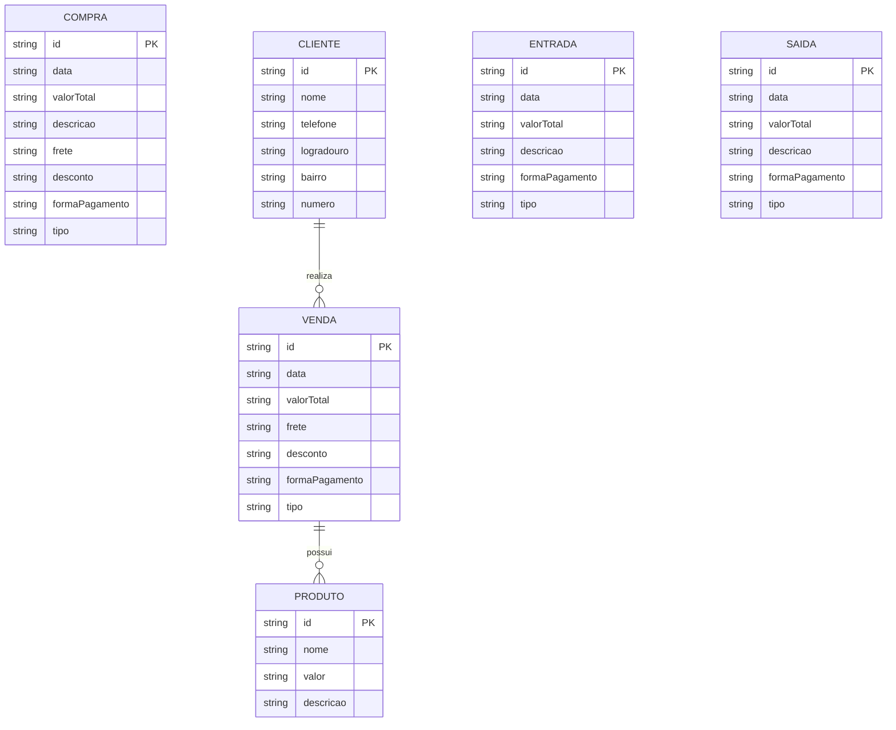

# Documento de Visão

Documento construído a partido do **Modelo BSI - Doc 001 - Documento de Visão** que pode ser encontrado no
link: https://docs.google.com/document/d/1DPBcyGHgflmz5RDsZQ2X8KVBPoEF5PdAz9BBNFyLa6A/edit?usp=sharing

## Descrição do Projeto

Um aplicativo desenvolvido para gerenciar de forma eficiente uma empresa de cookies, centralizando todas as informações essenciais do negócio em um só lugar. O sistema permite o controle do fluxo de caixa, registrando entradas e saídas, além de gerenciar produtos, clientes, compras e vendas. Também oferece acesso a históricos detalhados e dados monetários, facilitando a análise financeira e a tomada de decisões estratégicas. Intuitivo e prático, o app contribui para a organização e o crescimento sustentável da empresa.

## Equipe e Definição de Papéis

Membro     |     Papel   |   E-mail   |
---------  | ----------- | ---------- |
Elder    | Analista, Cliente | elder.silva.711@ufn.edu.br
Felipe     | Analista | felipe.brito.111@ufrn.edu.br
Pedro         | Analista | pedro.santos.142@ufrn.edu.br

### Matriz de Competências

Membro     |     Competências   |
---------  | ----------- |
Elder    | Design, Desenvolvedor FullStack, React Native, Django, Python, Axios, HTML, CSS, JS |
Felipe     | Desenvolvedor FullStack, React Native, Django, Python, Axios, Administração de Banco de dados |
Pedro       | Desenvolvedor FullStack, React Native, Django, Python, Axios, HTML, CSS, JS, Administração de servidores, SysAdmin |

## Perfis dos Usuários

O sistema será utilizado apenas por um usuário administrador.

Perfil Administrativo

---

Este perfil corresponde ao usuário responsável pela gestão completa do sistema. Todos os módulos disponíveis na aplicação poderão ser acessados, podendo realizar operações de cadastro, exclusão, edição e visualização de informações.

Entre suas principais funcionalidades está o gerenciamento das entradas financeiras, registrando as vendas diárias do negócio ou recebimentos provenientes de outras fontes. Também será responsável pelo controle das saídas financeiras, como despesas, compras, equipamentos, e custos operacionais.

Além disso, o administrador desempenha a função de cadastrar e gerenciar os produtos da empresa, incluindo seus custos de produção e os valores de venda, informações importantes para o controle financeiro. Outro módulo relevante para o gerenciamento do negócio é módulo clientes, onde o administrador poderá cadastrar, editar, excluir ou consultar informações acerca dos consumidores; auxiliando no controle de vendas, histórico de pedidos e relacionamento com os clientes.

## Lista de Requisitos Funcionais

### Entidade Entrada - RF01 - Manter Entrada
Uma entrada representa um registro financeiro de valor recebido. Possui: data, valor total, descrição, forma de pagamento e tipo de entrada.

Requisito                     | Descrição | Ator
---------                     | --------- | -----
RF01.01 - Inserir Entrada     | Insere uma nova entrada informando: data, valor total, descrição, forma de pagamento e tipo. | Administrador
RF01.02 - Atualizar Entrada   | Atualiza uma entrada informando: descrição, data, forma de pagamento e tipo. | Administrador
RF01.03 - Listar Entradas     | Lista entradas com filtros por: data, forma de pagamento e tipo. | Administrador
RF01.04 - Visualizar Entrada  | Visualiza detalhadamente uma entrada. | Administrador
RF01.05 - Deletar Entrada     | Deleta uma entrada até 23h59 do mesmo dia do cadastro. | Administrador

---

### Entidade Venda - RF02 - Manter Venda
Uma venda representa a comercialização de produtos para um cliente. Possui: data, cliente, itens da venda, valor total, forma de pagamento, desconto, frete e tipo.

Requisito                   | Descrição | Ator
---------                   | --------- | -----
RF02.01 - Inserir Venda     | Insere uma venda informando: data, cliente, itens, valor total, forma de pagamento, desconto, frete e tipo. | Administrador
RF02.02 - Atualizar Venda   | Atualiza: cliente, itens, forma de pagamento, desconto, frete e tipo, recalculando o valor total. | Administrador
RF02.03 - Listar Vendas     | Lista vendas com filtros por: data, cliente, forma de pagamento e tipo. | Administrador
RF02.04 - Visualizar Venda  | Visualiza detalhadamente uma venda. | Administrador
RF02.05 - Deletar Venda     | Deleta uma venda até 23h59 do mesmo dia do cadastro. | Administrador

---

### Entidade Saída - RF03 - Manter Saída
Uma saída representa um registro financeiro de valor gasto. Possui: data, valor total, descrição, forma de pagamento e tipo de saída.

Requisito                   | Descrição | Ator
---------                   | --------- | -----
RF03.01 - Inserir Saída     | Insere uma saída informando: data, valor total, descrição, forma de pagamento e tipo. | Administrador
RF03.02 - Atualizar Saída   | Atualiza: descrição, data, forma de pagamento e tipo. | Administrador
RF03.03 - Listar Saídas     | Lista saídas com filtros por: data, forma de pagamento e tipo. | Administrador
RF03.04 - Visualizar Saída  | Visualiza detalhadamente uma saída. | Administrador
RF03.05 - Deletar Saída     | Deleta uma saída até 23h59 do mesmo dia do cadastro. | Administrador

---

### Entidade Compra - RF04 - Manter Compra
Uma compra representa a aquisição de insumos ou produtos. Possui: descrição, data, itens, quantidade, valor unitário, frete, desconto, forma de pagamento, tipo e valor total calculado automaticamente.

Requisito                   | Descrição | Ator
---------                   | --------- | -----
RF04.01 - Inserir Compra    | Insere uma compra com: descrição, data, itens, quantidade, valor unitário, frete, desconto, forma de pagamento e tipo. | Administrador
RF04.02 - Atualizar Compra  | Atualiza todos os dados da compra, recalculando o valor total. | Administrador
RF04.03 - Listar Compras    | Lista compras com filtros por: data, forma de pagamento e tipo. | Administrador
RF04.04 - Visualizar Compra | Visualiza detalhadamente uma compra. | Administrador
RF04.05 - Deletar Compra    | Deleta uma compra até 23h59 do mesmo dia do cadastro. | Administrador

---

### Entidade Produto - RF05 - Manter Produto
Um produto representa um item comercializado. Possui: nome, descrição e valor.

Requisito                    | Descrição | Ator
---------                    | --------- | -----
RF05.01 - Inserir Produto    | Insere um produto com: nome, descrição e valor. | Administrador
RF05.02 - Atualizar Produto  | Atualiza: nome, descrição e valor. | Administrador
RF05.03 - Listar Produtos    | Lista todos os produtos. | Administrador
RF05.04 - Visualizar Produto | Visualiza detalhadamente um produto. | Administrador
RF05.05 - Deletar Produto    | Deleta um produto. | Administrador

---

### Entidade Tipo - RF06 - Manter Tipo
Um tipo classifica entradas, saídas, vendas ou compras. Possui: nome.

Requisito                  | Descrição | Ator
---------                  | --------- | -----
RF06.01 - Inserir Tipo     | Insere um tipo informando o nome. | Administrador
RF06.02 - Atualizar Tipo   | Atualiza o nome do tipo. | Administrador
RF06.03 - Listar Tipos     | Lista todos os tipos. | Administrador
RF06.04 - Visualizar Tipo  | Visualiza detalhadamente um tipo. | Administrador
RF06.05 - Deletar Tipo     | Deleta um tipo. | Administrador

---

### Entidade Cliente - RF07 - Manter Cliente
Um cliente representa quem realiza compras. Possui: nome, telefone e endereço (logradouro, bairro e número).

Requisito                     | Descrição | Ator
---------                     | --------- | -----
RF07.01 - Inserir Cliente     | Insere um cliente com: nome, telefone e endereço. | Administrador
RF07.02 - Atualizar Cliente   | Atualiza: nome, telefone e endereço. | Administrador
RF07.03 - Listar Clientes     | Lista clientes com filtro alfabético e busca. | Administrador
RF07.04 - Visualizar Cliente  | Visualiza detalhadamente um cliente. | Administrador
RF07.05 - Deletar Cliente     | Deleta um cliente. | Administrador

---

### Entidade Administrador - RF08 - Manter Administrador
Um administrador é o usuário do sistema. Possui: e-mail, nome, senha e dados monetários iniciais.

Requisito                       | Descrição | Ator
---------                       | --------- | -----
RF08.01 - Inserir Administrador | Realiza cadastro com: e-mail, nome, senha e dados monetários iniciais. | Administrador
RF08.02 - Atualizar Administrador | Atualiza: e-mail, nome e senha. | Administrador

---

### Entidade Histórico - RF09 - Manter Histórico
O histórico registra ações realizadas no sistema ao longo do tempo.

Requisito                         | Descrição | Ator
---------                         | --------- | -----
RF09.01 - Visualizar Histórico    | Visualiza ações realizadas no dia com filtro por data. | Administrador
RF09.02 - Acessar Ação Histórico  | Visualiza detalhadamente uma ação do histórico. | Administrador

---

### Entidade Relatório - RF10 - Manter Relatório
Relatórios apresentam dados consolidados por setor do sistema.

Requisito                        | Descrição | Ator
---------                        | --------- | -----
RF10.01 - Visualizar Relatórios  | Visualiza relatórios por setor. | Administrador
RF10.02 - Acessar Relatório      | Visualiza detalhadamente um relatório específico. | Administrador

---

### Modelo Conceitual

Esse é o modelo conceitual do projeto, desenvolvido usando **Mermaid**.

#### Descrição das Entidades

📦 Produto

Representa os itens comercializados pela empresa, contendo informações como nome, descrição e valor.

🧾 Venda

Representa a comercialização de produtos para um cliente, registrando dados como itens vendidos, valores, forma de pagamento, descontos e frete.

🛒 Compra

Representa a aquisição de insumos ou produtos pela empresa, incluindo informações de valores, itens, forma de pagamento e descrição.

👤 Cliente

Representa os clientes da empresa, armazenando dados de identificação e contato, como nome, telefone e endereço.

💰 Entrada

Representa valores que entram no caixa da empresa, como receitas diversas, contendo informações de data, valor, descrição, forma de pagamento e tipo.

💸 Saída

Representa valores que saem do caixa da empresa, como despesas, incluindo data, valor, descrição, forma de pagamento e tipo.

## Lista de Requisitos Não-Funcionais

Requisito                                 | Descrição   |
---------                                 | ----------- |
RNF01 - Deve ser acessível via navegador | Deve abrir perfeitamento no Firefox e no Chrome. |

## Riscos

Tabela com o mapeamento dos riscos do projeto, as possíveis soluções e os responsáveis.

Data | Risco | Prioridade | Responsável | Status | Providência/Solução |

### Referências