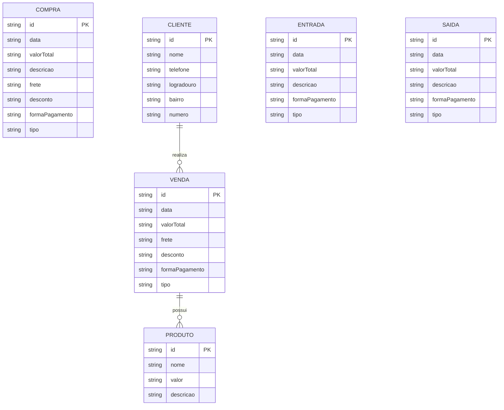

# Documento de Modelos

Neste documento temos o modelo Conceitual (UML) ou de Dados (Entidade-Relacionamento). Temos também a descrição das entidades e o dicionário de dados.

Para a modelagem pode se usar o Astah UML ou o BrModelo. Uma ferramenta interessante para modelos UML é a [YUML](http://yuml.me), no link temos um exemplo de [Modelo UML com YUML](yuml/monitoria-yuml.md). Atualmente é possível usar a ferramenta **Mermaid** segundo o blog do GitHub [Include diagrams in your Markdown files with Mermaid](https://github.blog/2022-02-14-include-diagrams-markdown-files-mermaid/). A documentação do **Mermaid** pode ser encontrada em [Mermaid in GitHub](https://mermaid-js.github.io/mermaid).

## Modelo Conceitual

### Diagrama de Classes usando Mermaid

### Descrição das Entidades

Descrição sucinta das entidades presentes no sistema.

| Entidade | Descrição |
|----------|-----------|
| Produto  | Entidade que representa os itens comercializados pela empresa, contendo as informações: nome, descrição e valor. |
| Venda    | Entidade que representa a comercialização de produtos, contendo as informações: data, valor total, frete, desconto, forma de pagamento e tipo. A venda está associada a um cliente e possui produtos. |
| Compra   | Entidade que representa a aquisição de produtos ou insumos, contendo as informações: data, valor total, descrição, frete, desconto, forma de pagamento e tipo. |
| Cliente  | Entidade que representa os clientes da empresa, contendo as informações: nome, telefone e endereço (logradouro, bairro e número). |
| Entrada  | Entidade que representa valores que entram no caixa da empresa, contendo as informações: data, valor total, descrição, forma de pagamento e tipo. |
| Saída    | Entidade que representa valores que saem do caixa da empresa, contendo as informações: data, valor total, descrição, forma de pagamento e tipo. |

## Modelo de Dados (Entidade-Relacionamento)

Modelo de Dados criado através do BrModelo

---

### 📊 Dicionário de Dados

| Nome              | Descrição                                      | Tipo de Dado | Tamanho | Restrições de Domínio        |
|-------------------|-----------------------------------------------|--------------|---------|------------------------------|
| id                | identificador único gerado pelo sistema       | SERIAL       | ---     | PK / Identity                |
| nome              | nome do produto ou cliente                    | VARCHAR      | 150     | Not Null                     |
| descricao         | descrição da entidade                         | VARCHAR      | 255     | ---                          |
| valor             | valor unitário do produto                     | DECIMAL      | 10,2    | Not Null                     |
| data              | data da transação                             | DATE         | ---     | Not Null                     |
| valor_total       | valor total da transação                      | DECIMAL      | 10,2    | Not Null                     |
| frete             | valor do frete                                | DECIMAL      | 10,2    | ---                          |
| desconto          | valor de desconto aplicado                    | DECIMAL      | 10,2    | ---                          |
| forma_pagamento   | forma de pagamento utilizada                  | VARCHAR      | 50      | Not Null                     |
| tipo              | tipo da transação (ex: despesa, ifood, etc.)  | VARCHAR      | 50      | Not Null                     |
| telefone          | telefone do cliente                           | VARCHAR      | 20      | ---                          |
| logradouro        | rua/endereço do cliente                       | VARCHAR      | 150     | ---                          |
| bairro            | bairro do cliente                             | VARCHAR      | 100     | ---                          |
| numero            | número do endereço                            | VARCHAR      | 10      | ---                          |
| cliente_id        | identificador do cliente                      | INTEGER      | ---     | FK                           |
| produto_id        | identificador do produto                      | INTEGER      | ---     | FK                           |